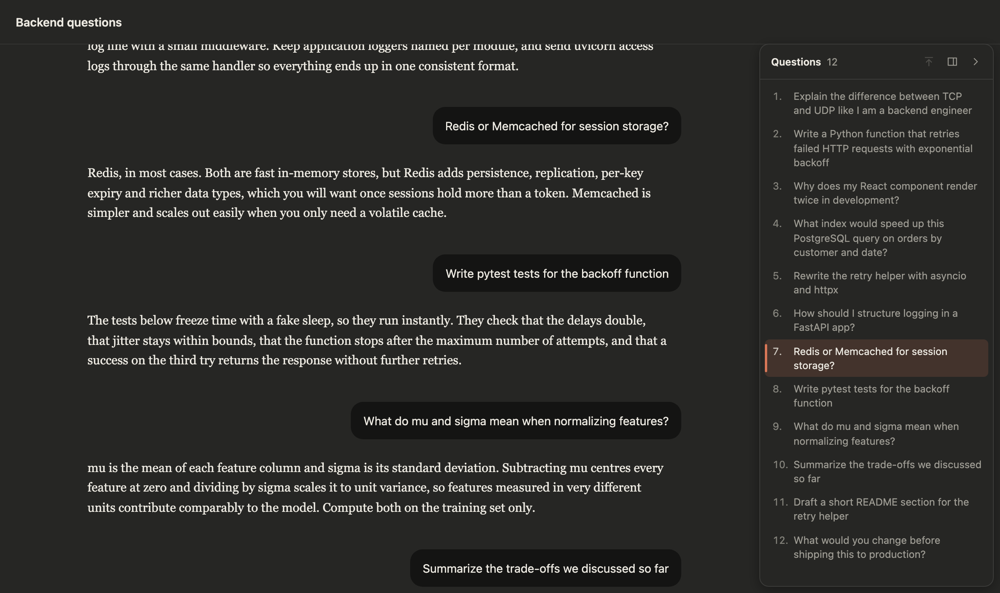

<div align="center">


# Claude Chat Outline

**A table of contents for your Claude.ai chats.**
Free Chrome extension that lists every question you asked in a Claude conversation, so you can jump to any message in one click instead of scrolling.

[](https://github.com/DereviankoAndrew/claude-chat-outline/releases/latest/download/claude-chat-outline.zip)
[](https://github.com/DereviankoAndrew/claude-chat-outline/stargazers)
[](LICENSE)


[Install](#install-in-2-minutes) · [Features](#features) · [FAQ](#faq) · [Privacy](#privacy) · [Website](https://dereviankoandrew.github.io/claude-chat-outline/)

</div>


<p align="center"><sub>The "Questions" panel on the right of a long chat (demo conversation). Dark mode is supported too.</sub></p>

## Why

Long Claude conversations are hard to navigate. Scrolling back to find "that question about
indexes" means scrolling through pages of answers, and claude.ai has no table of contents.

Claude Chat Outline adds one: a panel next to the chat with **every question you asked**, in
order. Click one to jump straight to it. The question you're currently reading is
highlighted as you scroll.

⭐ **If it saves you some scrolling, please star the repo.** It helps other Claude users find it.

## Features

- **Clickable outline of your questions.** Every message you sent in the current chat,
  numbered, with the full text on hover.
- **Jump to any message.** Click a question and the chat scrolls to it and briefly
  highlights it, even in very long chats and for messages claude.ai hasn't loaded yet.
- **Follows along as you read.** The question you are reading is highlighted in the panel.
- **The whole chat at once.** The list is complete as soon as you open a chat, and it
  doesn't change while you scroll.
- **Keyboard friendly.** <kbd>Cmd</kbd>/<kbd>Ctrl</kbd>+<kbd>Shift</kbd>+<kbd>O</kbd>
  toggles the panel. Arrow keys, Home and End move through the list.
- **Fits in.** Matches Claude's light and dark themes, can be resized, collapsed to a thin
  tab, or set to push the chat aside instead of overlaying it.
- **Private and lightweight.** No tracking, no accounts, no external servers, no build
  step, about 90 KB of plain, readable JavaScript.

## Install in 2 minutes

The extension is not in the Chrome Web Store yet, so you install it by hand. It takes four steps:

1. **[Download `claude-chat-outline.zip`](https://github.com/DereviankoAndrew/claude-chat-outline/releases/latest/download/claude-chat-outline.zip)**
   and unzip it. You get a folder called `claude-chat-outline`.
2. Open **`chrome://extensions`** in Chrome.
3. Turn on **Developer mode** (switch in the top-right corner).
4. Click **Load unpacked** and select the `claude-chat-outline` folder.

Open any chat on [claude.ai](https://claude.ai). The **Questions** panel appears on the
right. If a chat was already open, reload the tab.

Works in **Google Chrome, Microsoft Edge, Brave, Arc, Opera, Vivaldi** and other
Chromium-based browsers (version 114 or newer). Keep the unzipped folder: the browser
loads the extension from it.

<details>
<summary><b>Install with git instead</b> (easier to update)</summary>

```sh
git clone https://github.com/DereviankoAndrew/claude-chat-outline.git
```

Then do steps 2 to 4 above with the cloned folder. To update later, run `git pull` and click
the reload icon on the extension's card in `chrome://extensions`.

</details>

<details>
<summary><b>Update to a new version</b></summary>

Download the new ZIP, replace the old folder's contents with it, then click the reload icon
on the extension's card in `chrome://extensions` and reload your claude.ai tabs.
**Watch → Custom → Releases** on this repo to be notified about new versions.

</details>

## How to use it

| To | Do this |
| --- | --- |
| Jump to a question | Click it (or Tab into the list and press Enter) |
| Move through the list | <kbd>↑</kbd> <kbd>↓</kbd> <kbd>Home</kbd> <kbd>End</kbd> |
| Show or hide the panel | <kbd>Cmd</kbd>+<kbd>Shift</kbd>+<kbd>O</kbd> on Mac, <kbd>Ctrl</kbd>+<kbd>Shift</kbd>+<kbd>O</kbd> on Windows/Linux, or the › button |
| Collapse it while it's focused | <kbd>Esc</kbd> |
| Resize it | Drag its left edge (200 to 520 px) |
| Stop it covering the chat | The ◫ button: push mode moves the chat aside |
| Reload the list | The ↑ button ("Load all questions") |

The panel only appears on conversation pages (`claude.ai/chat/…`), including chats inside
Projects.

<details>
<summary>Dark mode screenshot</summary>



</details>

## Privacy

- **No data leaves claude.ai.** To list every question, the extension reads the open
  conversation from claude.ai's own API, the same request the claude.ai page makes, using
  your existing login. Nothing is sent to any other server, and there is no analytics.
- **Stored only on your computer.** The extension's local storage keeps your panel settings
  and a cache of the question texts of recently opened chats (the 200 most recent, deleted
  after 90 days), so a chat you open again is listed instantly. Removing the extension
  deletes it.
- **One permission.** `storage`. It runs only on `claude.ai`.
- **Open source.** All of it is readable in [`src/`](src), with no minified or bundled code.

## FAQ

### How do I navigate long Claude conversations?

Install this extension. It adds a clickable list of all your questions to every Claude chat,
like a table of contents. Click a question to jump to it.

### Does it work with Claude Projects, artifacts and code blocks?

Yes. It works in any conversation, including chats inside Projects. Questions that contain code blocks,
attachments or markdown are listed and navigable too. When an artifact panel is open, collapse
the outline (<kbd>Esc</kbd> or ›) if it covers the artifact.

### Does it work in Firefox or Safari?

Not yet. It is a Chrome (Manifest V3) extension and runs in Chromium-based browsers:
Chrome, Edge, Brave, Arc, Opera and Vivaldi.

### Does it work for ChatGPT or Gemini?

No, it is built specifically for claude.ai.

### Is it safe? Can it read my chats?

It only runs on claude.ai and only reads the conversation you have open, to list your
questions. It never sends anything anywhere except claude.ai itself. The code is short and fully readable;
see [Privacy](#privacy).

### The panel doesn't show up or the list is empty

Reload the claude.ai tab after installing or updating. If it still doesn't work, Claude may
have changed its page. Please [open an issue](https://github.com/DereviankoAndrew/claude-chat-outline/issues/new)
and include the output of `__claudeOutline.debug()` from the DevTools console (it contains no
message text).

### Cmd/Ctrl+Shift+O opens Chrome's Bookmark Manager instead

The extension catches the shortcut while a claude.ai tab is focused. Click into the page
first. You can also always use the › button or the "Outline" tab.

## Contributing

Bug reports, ideas and pull requests are welcome. See [docs/DEVELOPMENT.md](docs/DEVELOPMENT.md)
for how it works, how to fix it when claude.ai changes its markup, and how to run the tests
(`python3 test/run.py`).

If you find it useful, **[⭐ star the repo](https://github.com/DereviankoAndrew/claude-chat-outline/stargazers)**
and share it with someone who lives in long Claude chats.

## License

[MIT](LICENSE). Free to use, modify and share.

<sub>Claude Chat Outline is an independent open-source project. It is not affiliated with,
endorsed by or sponsored by Anthropic. "Claude" is a trademark of Anthropic, PBC.</sub>
