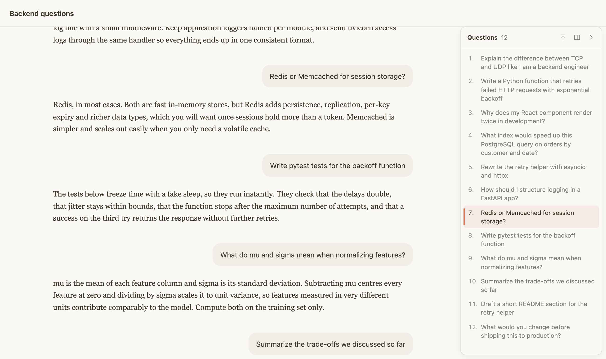

# Claude Chat Outline

A Chrome extension that adds a table of contents to claude.ai chats: every question you asked, in one panel. Click one to jump to it, even in very long chats.

**[See it in action →](https://afterglow1251.github.io/claude-chat-outline/)**



## Install

1. Download [`claude-chat-outline.zip`](https://github.com/afterglow1251/claude-chat-outline/releases/latest/download/claude-chat-outline.zip) and unzip it.
2. Open `chrome://extensions` and turn on **Developer mode**.
3. Click **Load unpacked** and pick the unzipped folder.

Works in Chrome, Edge, Brave, Arc and other Chromium browsers (114+).

## Use

- Click a question to jump to it. The one you're reading is highlighted.
- Search the list and star questions to keep important ones at hand.
- <kbd>Cmd</kbd>/<kbd>Ctrl</kbd>+<kbd>Shift</kbd>+<kbd>↑</kbd> / <kbd>↓</kbd> jumps to the previous or next question, with the panel open or closed.
- Point at the icon in the panel's header to switch between your questions, the diagrams Claude drew (with a live preview of each) and the code it wrote (with a copy button). Click a diagram or a code block to jump straight to it in the chat.
- <kbd>Cmd</kbd>/<kbd>Ctrl</kbd>+<kbd>Shift</kbd>+<kbd>O</kbd> shows or hides the panel.

## Privacy

Runs only on claude.ai and reads the open chat through claude.ai's own API. Nothing is sent anywhere else. Settings, a cache of question texts and the question you last read in each chat stay in local storage.

## Develop

```sh
npm install
npm run build        # builds the extension into dist/ (load that folder)
npm run check        # types, lint, formatting
npm test             # unit + headless browser tests
```

Code lives in `src/`: `outline/` finds and jumps to questions, `ui/` is the panel, `data/` reads claude.ai's API, `core/` holds shared types and selectors. When claude.ai changes its markup, start with `src/core/selectors.ts`.

## License

[MIT](LICENSE). Not affiliated with Anthropic.
